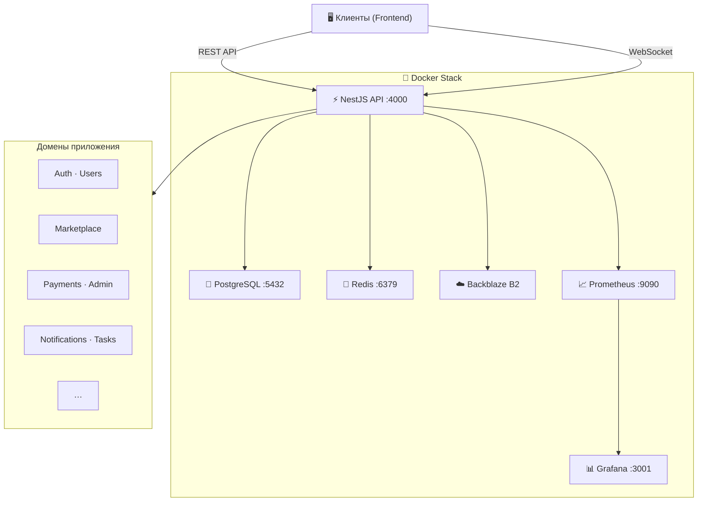

<div align="center">

# ⚒️ MasterHub API

### Маркетплейс мастеров

**NestJS 11** · **Prisma 7** · **PostgreSQL 18** · **Redis 7** · **Docker**

---

</div>

## 📖 О проекте

MasterHub — бэкенд-сервис маркетплейса для поиска и управления мастерами (сервисными специалистами). Построен на NestJS с модульной архитектурой: REST API, WebSocket, очереди Bull, платежи, уведомления и мониторинг.

Отдельно собирается **worker** (`nest build worker`, `worker.ts`) — фоновые задачи без полного HTTP-стека API.

---

## 🛠 Стек технологий

**Ядро:** Node.js ≥ 20 · TypeScript 5.9 · NestJS 11 (Express)

**Данные:** PostgreSQL 18 · Prisma 7 · Redis 7 · Bull Queues

**Аутентификация:** JWT (Access + Refresh) · Passport.js · OAuth2 (Google, Facebook)

**Реал-тайм:** Socket.IO (WebSocket Gateway)

**Хранилище:** Backblaze B2 (S3-совместимый) · Multer

**Платежи:** MIA / MAIB QR

**Уведомления:** Twilio SMS · WhatsApp · Nodemailer · Telegram Bot

**Безопасность:** Helmet · CORS · Rate Limiting · Sanitize-HTML

**Мониторинг:** Prometheus · Grafana · Winston

**Тесты:** Jest · Supertest

**CI/CD:** GitHub Actions (4 workflows) · Dependabot

---

## 🏗 Архитектура



---

## 🚀 Быстрый старт

### Требования

- Node.js ≥ 20 и npm ≥ 10
- Docker + Docker Compose (рекомендуется)
- PostgreSQL 18 и Redis 7 (если без Docker)

### Шаг 1 — Клонирование

```bash
git clone <repository-url>
cd api-master
npm install
```

### Шаг 2 — Настройка окружения

```bash
cp .env.docker.example .env.docker
node scripts/generate-secrets.js
```

Заполните обязательные переменные в `.env.docker` (см. [переменные окружения](#-переменные-окружения)).

### Шаг 3 — Запуск через Docker 🐳

```bash
# Поднять все сервисы
docker-compose -f docker-compose.dev.yml up -d --build

# Применить миграции
npm run docker:migrate

# Заполнить тестовыми данными
npm run docker:seed
```

### Шаг 4 — Проверка

| Сервис | URL |
|---|---|
| API | `http://localhost:4000` |
| Swagger Docs | `http://localhost:4000/docs` |
| Health Check | `http://localhost:4000/health` |
| Prisma Studio | `http://localhost:5555` |
| Redis Commander | `http://localhost:8081` |
| Prometheus | `http://localhost:9090` |
| Grafana | `http://localhost:3001` |

> **Примечание:** Redis Commander и Grafana доступны с логином `admin` / `admin`.

---

## 🔐 Переменные окружения

<details>
<summary>🔽 Нажмите, чтобы развернуть полный список</summary>

<br>

### Основные

| Переменная | Обязательна | Описание | По умолчанию |
|---|:---:|---|---|
| `NODE_ENV` | ✅ | `development` или `production` | `development` |
| `PORT` | — | Порт API | `4000` |
| `API_URL` | — | Публичный URL API | `http://localhost:4000` |
| `FRONTEND_URL` | ✅ prod | URL фронтенда | `http://localhost:3000` |

### База данных и Redis

| Переменная | Обязательна | Описание | По умолчанию |
|---|:---:|---|---|
| `DATABASE_URL` | ✅ | PostgreSQL connection string | — |
| `REDIS_URL` | ✅ | Redis connection string | `redis://redis:6379` |
| `REDIS_HOST` | — | Хост Redis | `redis` |
| `REDIS_PORT` | — | Порт Redis | `6379` |

### JWT и шифрование

| Переменная | Обязательна | Описание |
|---|:---:|---|
| `JWT_ACCESS_SECRET` | ✅ | Секрет access-токенов (мин. 32 символа) |
| `JWT_REFRESH_SECRET` | ✅ | Секрет refresh-токенов (мин. 32 символа) |
| `JWT_ACCESS_EXPIRY` | — | Время жизни access-токена (`3d`) |
| `ID_ENCRYPTION_SECRET` | ✅ | Секрет шифрования ID (32 символа) |
| `ENCRYPTION_KEY` | ✅ | Ключ шифрования (64 hex-символа) |

### OAuth (опционально)

| Переменная | Описание |
|---|---|
| `GOOGLE_CLIENT_ID` / `GOOGLE_CLIENT_SECRET` | Google OAuth |
| `FACEBOOK_APP_ID` / `FACEBOOK_APP_SECRET` | Facebook OAuth |

### Платежи MIA (опционально)

| Переменная | Описание | По умолчанию |
|---|---|---|
| `MIA_CLIENT_ID` / `MIA_CLIENT_SECRET` | MAIB API ключи | — |
| `MIA_BASE_URL` | URL MIA API | `https://api.maib.md` |
| `MIA_SANDBOX` | Sandbox-режим | `true` |

### Файлы — Backblaze B2 (опционально)

| Переменная | Описание | По умолчанию |
|---|---|---|
| `B2_APPLICATION_KEY_ID` / `B2_APPLICATION_KEY` | B2 ключи | — |
| `B2_BUCKET` | Название бакета | `master-hub-uploads` |
| `B2_REGION` | Регион | `eu-central-003` |

### Уведомления (опционально)

| Переменная | Описание |
|---|---|
| `TWILIO_ACCOUNT_SID` / `TWILIO_AUTH_TOKEN` | Twilio (SMS) |
| `TWILIO_PHONE_NUMBER` | Номер для SMS |
| `TELEGRAM_BOT_TOKEN` / `TELEGRAM_CHAT_ID` | Telegram Bot |
| `EMAIL_ENABLED` | Включить email (`false`) |
| `SMS_ENABLED` | Включить SMS (`false`) |

### Rate Limiting

| Переменная | Описание | По умолчанию |
|---|---|---|
| `RATE_LIMIT_TTL` | Окно лимита (мс) | `60000` |
| `RATE_LIMIT_MAX` | Макс. запросов | `100` |

</details>

---

## 🐳 Docker

### Dev-окружение

```bash
npm run docker:up          # alias: docker:dev:up — поднять стек
npm run docker:dev:down    # остановить
npm run docker:dev:build   # пересобрать образы
npm run docker:logs        # логи API-контейнера
```

| Контейнер | Порт | Назначение |
|---|---|---|
| `masterhub-api-dev` | 4000 | NestJS API |
| `masterhub-postgres` | 5432 | PostgreSQL |
| `masterhub-redis` | 6379 | Redis |
| `masterhub-redis-commander` | 8081 | Redis GUI |
| `masterhub-prisma-studio` | 5555 | Визуальный редактор БД |
| `masterhub-prometheus-dev` | 9090 | Метрики |
| `masterhub-grafana-dev` | 3001 | Дашборды |

### Prod-окружение

```bash
npm run docker:prod:up       # поднять
npm run docker:prod:down     # остановить
npm run docker:prod:rebuild  # пересобрать и обновить
npm run docker:prod:logs     # логи
```

> Prod использует порты: API `4001`, PostgreSQL `5433`, Redis `6380`, Prometheus `9091`, Grafana `3002`.

### Dockerfile

Многоступенчатая сборка:

- **builder** → Компиляция TypeScript + Prisma Generate
- **dependencies** → Только production-зависимости
- **production** → Alpine + non-root user + dumb-init + healthcheck
- **development** → Полная среда с hot-reload

---

## 📜 NPM-скрипты

### Разработка и запуск

| Команда | Описание |
|---|---|
| `npm run start` | Запуск без watch |
| `npm run start:dev` | API с hot-reload (`nest start --watch`) |
| `npm run start:debug` | API с отладчиком и watch |
| `npm run start:prod` | Запуск собранного `dist/main.js` |
| `npm run build` | Сборка API (`nest build`) |
| `npm run build:worker` | Сборка worker (`nest build worker`) |
| `npm run start:worker` | Запуск `dist/worker.js` |
| `npm run start:worker:dev` | Worker через ts-node (разработка) |
| `npm run lint` | ESLint с автофиксом |
| `npm run format` | Prettier для `src/` и `test/` |
| `npm run prepare` | Husky (git hooks) |

### Prisma и данные

| Команда | Описание |
|---|---|
| `npm run prisma:generate` | Генерация Prisma Client |
| `npm run prisma:migrate` | `prisma migrate dev` (имя миграции `init` — при необходимости передайте своё имя через CLI) |
| `npm run prisma:reset` | ⚠️ Полный сброс БД |
| `npm run seed` | Сид из `prisma/seed.ts` |
| `npm run seed:dev` | `prisma/seed-dev.ts` |
| `npm run seed:prod` | `prisma/seed-prod.ts` |
| `npm run local:recreate:db` | reset → migrate → generate → seed (локально) |

> Prisma Studio в Docker: `npm run docker:studio` (порт 5555). Локально: `npx prisma studio`.

### Docker (общие и dev)

| Команда | Описание |
|---|---|
| `npm run docker:up` / `docker:dev:up` | Поднять dev-стек |
| `npm run docker:down` / `docker:dev:down` | Остановить dev-стек |
| `npm run docker:build` / `docker:dev:build` | Сборка образов dev |
| `npm run docker:logs` | Логи API в dev |
| `npm run docker:dev:create` | build → up → reset → migrate → generate → seed (полное пересоздание dev-БД в контейнере) |
| `npm run docker:migrate` | `prisma migrate deploy` в dev-контейнере |
| `npm run docker:migrate:dev` | то же, что `docker:migrate` |
| `npm run docker:migrate:create` | интерактивная новая миграция в dev-контейнере |
| `npm run docker:migrate:reset` | reset в dev-контейнере |
| `npm run docker:migrate:prod` | миграции в prod-контейнере |
| `npm run docker:generate` | `prisma generate` в dev-контейнере |
| `npm run docker:seed` / `docker:seed:prod` | сиды в dev / prod контейнере |
| `npm run docker:studio` | поднять сервис Prisma Studio (compose) |
| `npm run docker:studio:logs` | логи Prisma Studio |
| `npm run docker:prune` | очистка dev + prod volumes/images |
| `npm run docker:prune:dev` / `docker:prune:prod` | очистка по окружению |

### Docker (prod)

| Команда | Описание |
|---|---|
| `npm run docker:prod:up` | Поднять prod-стек |
| `npm run docker:prod:down` | Остановить |
| `npm run docker:prod:build` | Сборка |
| `npm run docker:prod:logs` | Логи |
| `npm run docker:prod:rebuild` | rebuild с пересозданием контейнеров |

### Redis

| Команда | Описание |
|---|---|
| `npm run redis:cli` | Redis CLI в контейнере |
| `npm run redis:ping` | Проверка PING |
| `npm run redis:keys` | Ключи `cache:*` |
| `npm run redis:flush` | ⚠️ Очистить текущую БД Redis |
| `npm run redis:commander` | Поднять Redis Commander |

### Тесты

| Команда | Описание |
|---|---|
| `npm test` | Юнит-тесты (`test/jest-unit.json`) |
| `npm run test:watch` | Watch-режим |
| `npm run test:cov` | С покрытием |
| `npm run test:e2e` | E2E (`test/jest-e2e.json`) |
| `npm run test:e2e:debug` | E2E с `detectOpenHandles` |
| `npm run test:api` | E2E только `test/api` |

### Утилиты

| Команда | Описание |
|---|---|
| `npm run generate:secrets` | Генерация секретов (`scripts/generate-secrets.js`) |
| `npm run backup` | Бэкап БД (`scripts/backup.sh`, нужен bash) |
| `npm run restore` | Восстановление (`scripts/restore.sh`) |
| `npm run update:deps` | Обновить зависимости (npm-check-updates `-u`) |
| `npm run update:deps:check` | Показать доступные обновления без изменений |

---

## 📂 Структура проекта

```
api-master/
│
├── .github/workflows/          CI/CD (backend-ci, docker-build, docker-health, pr-checks)
├── docker/                     Конфиги Grafana, Prometheus, Redis
├── prisma/
│   ├── migrations/             SQL-миграции
│   ├── seeds/                  Вспомогательные сиды (core, demo, connection)
│   ├── schema.prisma
│   ├── seed.ts                 Точка входа сида
│   ├── seed-dev.ts
│   └── seed-prod.ts
├── scripts/                    backup, restore, generate-secrets и др.
├── src/
│   ├── main.ts                 Точка входа HTTP API
│   ├── worker.ts               Точка входа фонового worker
│   ├── app.module.ts           Корневой модуль приложения
│   ├── worker.module.ts        Модуль worker (Bull, cron, часть доменов)
│   ├── app/                    Базовые маршруты приложения (health и т.д.)
│   ├── config/                 Конфигурация: CORS, Helmet, Bull, Winston, shutdown, валидация
│   ├── common/                 Декораторы, guards, interceptors, pipes, filters, константы
│   ├── middleware/
│   └── modules/                Доменные и инфраструктурные модули (см. ниже)
├── test/
│   ├── api/                    API / E2E
│   └── (jest-unit.json, jest-e2e.json)
├── nest-cli.json               Проекты `api` и `worker` (SWC)
├── Dockerfile
├── docker-compose.dev.yml
├── docker-compose.prod.yml
└── package.json
```

---

## 🧩 API-модули

Модули лежат в `src/modules/`. В `app.module.ts` подключаются **функциональные** модули; часть сгруппирована агрегаторами (`*GroupModule`).

### Приложение и настройки

| Путь / модуль | Назначение |
|---|---|
| `app/` | Корневые HTTP-маршруты (в т.ч. health), `AppService` |
| `app-settings/` | Настройки приложения из БД (фичефлаги и параметры для других модулей) |

### Аутентификация и пользователи (`auth-group`, `users`)

| Модуль | Назначение |
|---|---|
| `auth/auth/` | JWT, регистрация/вход, OAuth (Google, Facebook), refresh |
| `auth/security/` | Безопасность: rate limiting, защита от brute-force |
| `auth/phone-verification/` | Верификация телефона |
| `users/` | Профили пользователей, аватары |

### Маркетплейс (`marketplace-group`)

| Модуль | Назначение |
|---|---|
| `marketplace/masters/` | Профили мастеров, поиск, портфолио |
| `marketplace/categories/` | Категории услуг |
| `marketplace/cities/` | Города |
| `marketplace/tariffs/` | Тарифы (Free / Premium и т.д.) |
| `marketplace/leads/` | Заявки клиентов |
| `marketplace/bookings/` | Бронирования |
| `marketplace/reviews/` | Отзывы и рейтинги |
| `marketplace/favorites/` | Избранное |
| `marketplace/chat/` | Чат (совместно с WebSocket) |
| `marketplace/promotions/` | Промо-акции |

### Платежи и админка

| Модуль | Назначение |
|---|---|
| `payments/` | Платежи MIA / MAIB QR |
| `admin/admin/` | Админ-панель (роль ADMIN) |

> `analytics`, `export`, `reports` используются не только админом — подключены в корне `app.module.ts` отдельно.

### Уведомления (`notifications-group`)

| Модуль | Назначение |
|---|---|
| `notifications/notifications/` | In-app, SMS, Telegram, очереди Bull, связка с WebSocket |
| `notifications/web-push/` | Web Push |
| `notifications/digest/` | Дайджесты / подписки |

### Вовлечённость и аналитика

| Модуль | Назначение |
|---|---|
| `engagement/recommendations/` | Рекомендации мастеров |
| `engagement/referrals/` | Реферальная программа |
| `analytics/` | Аналитика и метрики |
| `export/` | Экспорт (Excel, PDF), очереди |
| `reports/` | Жалобы и репорты |

### Соответствие и аудит

| Модуль | Назначение |
|---|---|
| `consent/` | Согласия пользователей (GDPR-подобные сценарии) |
| `compliance/` | Комплаенс |
| `audit/` | Аудит действий |
| `verification/` | Верификация мастеров (документы) |

### Инфраструктура

| Модуль | Назначение |
|---|---|
| `infrastructure/files/` | Загрузка файлов, S3/B2, Multer |
| `infrastructure/tasks/` | Планировщик и фоновые задачи (cron / Bull) |
| `infrastructure/websocket/` | Socket.IO gateway |
| `infrastructure/cache-warming/` | Прогрев кэша |
| `infrastructure/web-vitals/` | Сбор Web Vitals с клиента |

### Общие сервисы (`shared/`)

| Модуль | Назначение |
|---|---|
| `shared/database/` | PrismaModule |
| `shared/redis/` | Redis-клиент |
| `shared/cache/` | Кэширование |
| `shared/encryption/` | Шифрование (подключается в auth/verification) |
| `shared/utils/` | Утилиты |

### Прочее

| Модуль | Назначение |
|---|---|
| `email/` | Отправка писем (Nodemailer) |

### Worker

`worker.module.ts` подключает подмножество модулей (Bull-процессоры, cron, прогрев кэша, экспорт и зависимости без полного HTTP API). Сборка: `npm run build:worker`, запуск: `npm run start:worker` / `start:worker:dev`.

---

## 📊 Мониторинг

### Prometheus + Grafana

- **Prometheus** (`localhost:9090`) — сбор метрик через `prom-client`
- **Grafana** (`localhost:3001`) — дашборды визуализации
- Конфиги: `docker/prometheus.yml`, `docker/grafana/`

### Логирование

- **Winston** с ротацией (`winston-daily-rotate-file`)
- JSON-формат в production, цветной вывод в development
- Логи сохраняются в `logs/`

### Health Check

```bash
curl http://localhost:4000/health
```

Проверяет доступность PostgreSQL и Redis через `@nestjs/terminus`.

---

## ⚙️ CI/CD

| Workflow | Триггер | Что делает |
|---|---|---|
| `backend-ci.yml` | push, PR | Lint → Unit-тесты → Type-check |
| `docker-build.yml` | push, PR | Сборка Docker-образа |
| `docker-health.yml` | push, PR | Healthcheck в Docker |
| `pr-checks.yml` | PR | Полная проверка (lint, тесты, build) |

**Dependabot** автоматически обновляет npm-зависимости и GitHub Actions.

---

## 🚀 Продакшн

### Чек-лист

- [ ] `NODE_ENV=production`
- [ ] Безопасные секреты (`npm run generate:secrets`)
- [ ] Заменить дефолтные пароли (PostgreSQL, Grafana, Redis)
- [ ] Настроить `FRONTEND_URL`
- [ ] SSL/TLS через reverse proxy (Nginx / Traefik)
- [ ] Backblaze B2 для файлов
- [ ] Настроить бэкапы БД

### Деплой

```bash
# 1. Создать prod-конфиг из шаблона
cp .env.production.example .env
# Заполнить .env (секреты, API_URL, FRONTEND_URL)

# 2. Запустить (compose подхватывает .env)
npm run docker:prod:up

# 3. Миграции
npm run docker:migrate:prod

# 4. Сид (при первом запуске)
npm run docker:seed:prod
```

### Безопасность

- ✅ Non-root user в Docker
- ✅ Helmet (HSTS, CSP, Referrer Policy)
- ✅ Rate Limiting (Throttler)
- ✅ CORS — только разрешённые домены
- ✅ Input Validation (class-validator)
- ✅ XSS-защита (sanitize-html)
- ✅ Graceful Shutdown (SIGTERM / SIGINT)
- ✅ Проверка секретов при старте

---

<div align="center">

© 2026 MasterHub Team · Все права защищены

</div>
