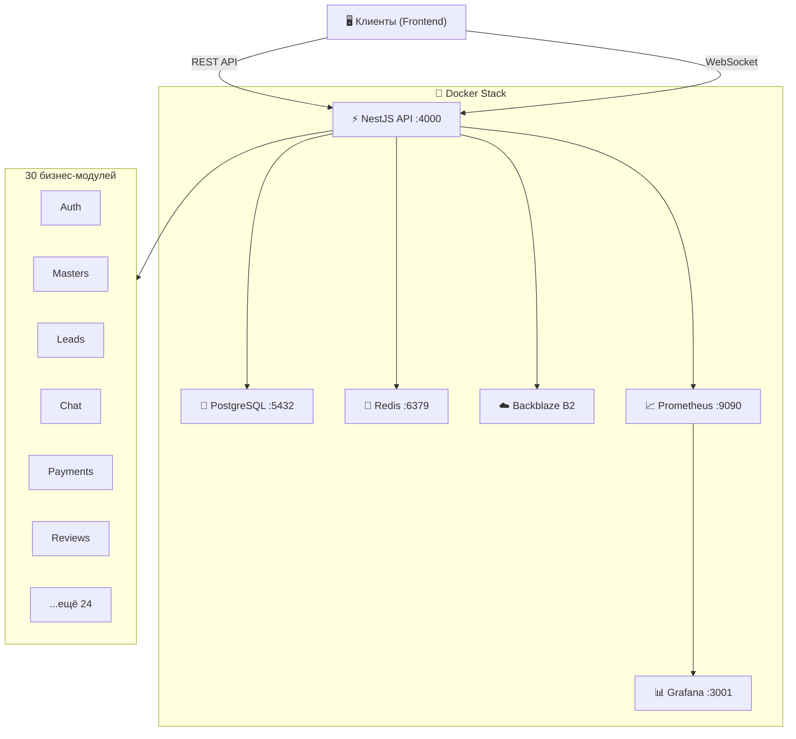

<div align="center">

# ⚒️ MasterHub API

### Маркетплейс мастеров

**NestJS 11** · **Prisma 7** · **PostgreSQL 18** · **Redis 7** · **Docker**

---

</div>

## 📖 О проекте

MasterHub — бэкенд-сервис маркетплейса для поиска и управления мастерами (сервисными специалистами). Построен на NestJS с модульной архитектурой, включает 30 бизнес-модулей, реал-тайм чат, систему платежей, уведомления и полный мониторинг.

---

## 🛠 Стек технологий

**Ядро:** Node.js 25 · TypeScript 5.9 · NestJS 11 (Express)

**Данные:** PostgreSQL 18 · Prisma 7 · Redis 7 · Bull Queues

**Аутентификация:** JWT (Access + Refresh) · Passport.js · OAuth2 (Google, Facebook)

**Реал-тайм:** Socket.IO (WebSocket Gateway)

**Хранилище:** Backblaze B2 (S3-совместимый) · Multer

**Платежи:** MIA / MAIB QR

**Уведомления:** Twilio SMS · WhatsApp · Nodemailer · Telegram Bot

**Безопасность:** Helmet · CORS · Rate Limiting · Sanitize-HTML

**Мониторинг:** Prometheus · Grafana · Winston

**Тесты:** Jest · Supertest · Chai

**CI/CD:** GitHub Actions (4 workflows) · Dependabot

---

## 🏗 Архитектура



---

## 🚀 Быстрый старт

### Требования

- Node.js ≥ 25 и npm ≥ 10
- Docker + Docker Compose (рекомендуется)
- PostgreSQL 18 и Redis 7 (если без Docker)

### Шаг 1 — Клонирование

```bash
git clone <repository-url>
cd api-master
npm install
```

### Шаг 2 — Настройка окружения

```bash
cp .env.docker.example .env.docker
node scripts/generate-secrets.js
```

Заполните обязательные переменные в `.env.docker` (см. [переменные окружения](#-переменные-окружения)).

### Шаг 3 — Запуск через Docker 🐳

```bash
# Поднять все сервисы
docker-compose -f docker-compose.dev.yml up -d --build

# Применить миграции
npm run docker:migrate

# Заполнить тестовыми данными
npm run docker:seed
```

### Шаг 4 — Проверка

| Сервис | URL |
|---|---|
| API | `http://localhost:4000` |
| Swagger Docs | `http://localhost:4000/docs` |
| Health Check | `http://localhost:4000/health` |
| Prisma Studio | `http://localhost:5555` |
| Redis Commander | `http://localhost:8081` |
| Prometheus | `http://localhost:9090` |
| Grafana | `http://localhost:3001` |

> **Примечание:** Redis Commander и Grafana доступны с логином `admin` / `admin`.

---

## 🔐 Переменные окружения

<details>
<summary>🔽 Нажмите, чтобы развернуть полный список</summary>

<br>

### Основные

| Переменная | Обязательна | Описание | По умолчанию |
|---|:---:|---|---|
| `NODE_ENV` | ✅ | `development` или `production` | `development` |
| `PORT` | — | Порт API | `4000` |
| `API_URL` | — | Публичный URL API | `http://localhost:4000` |
| `FRONTEND_URL` | ✅ prod | URL фронтенда | `http://localhost:3000` |

### База данных и Redis

| Переменная | Обязательна | Описание | По умолчанию |
|---|:---:|---|---|
| `DATABASE_URL` | ✅ | PostgreSQL connection string | — |
| `REDIS_URL` | ✅ | Redis connection string | `redis://redis:6379` |
| `REDIS_HOST` | — | Хост Redis | `redis` |
| `REDIS_PORT` | — | Порт Redis | `6379` |

### JWT и шифрование

| Переменная | Обязательна | Описание |
|---|:---:|---|
| `JWT_ACCESS_SECRET` | ✅ | Секрет access-токенов (мин. 32 символа) |
| `JWT_REFRESH_SECRET` | ✅ | Секрет refresh-токенов (мин. 32 символа) |
| `JWT_ACCESS_EXPIRY` | — | Время жизни access-токена (`3d`) |
| `ID_ENCRYPTION_SECRET` | ✅ | Секрет шифрования ID (32 символа) |
| `ENCRYPTION_KEY` | ✅ | Ключ шифрования (64 hex-символа) |

### OAuth (опционально)

| Переменная | Описание |
|---|---|
| `GOOGLE_CLIENT_ID` / `GOOGLE_CLIENT_SECRET` | Google OAuth |
| `FACEBOOK_APP_ID` / `FACEBOOK_APP_SECRET` | Facebook OAuth |

### Платежи MIA (опционально)

| Переменная | Описание | По умолчанию |
|---|---|---|
| `MIA_CLIENT_ID` / `MIA_CLIENT_SECRET` | MAIB API ключи | — |
| `MIA_BASE_URL` | URL MIA API | `https://api.maib.md` |
| `MIA_SANDBOX` | Sandbox-режим | `true` |

### Файлы — Backblaze B2 (опционально)

| Переменная | Описание | По умолчанию |
|---|---|---|
| `B2_APPLICATION_KEY_ID` / `B2_APPLICATION_KEY` | B2 ключи | — |
| `B2_BUCKET` | Название бакета | `master-hub-uploads` |
| `B2_REGION` | Регион | `eu-central-003` |

### Уведомления (опционально)

| Переменная | Описание |
|---|---|
| `TWILIO_ACCOUNT_SID` / `TWILIO_AUTH_TOKEN` | Twilio (SMS) |
| `TWILIO_PHONE_NUMBER` | Номер для SMS |
| `TELEGRAM_BOT_TOKEN` / `TELEGRAM_CHAT_ID` | Telegram Bot |
| `EMAIL_ENABLED` | Включить email (`false`) |
| `SMS_ENABLED` | Включить SMS (`false`) |

### Rate Limiting

| Переменная | Описание | По умолчанию |
|---|---|---|
| `RATE_LIMIT_TTL` | Окно лимита (мс) | `60000` |
| `RATE_LIMIT_MAX` | Макс. запросов | `100` |

</details>

---

## 🐳 Docker

### Dev-окружение

```bash
npm run docker:dev:up        # Поднять
npm run docker:dev:down      # Остановить
npm run docker:dev:build     # Пересобрать (без кэша)
npm run docker:logs          # Логи API
```

| Контейнер | Порт | Назначение |
|---|---|---|
| `masterhub-api-dev` | 4000 | NestJS API |
| `masterhub-postgres` | 5432 | PostgreSQL |
| `masterhub-redis` | 6379 | Redis |
| `masterhub-redis-commander` | 8081 | Redis GUI |
| `masterhub-prisma-studio` | 5555 | Визуальный редактор БД |
| `masterhub-prometheus-dev` | 9090 | Метрики |
| `masterhub-grafana-dev` | 3001 | Дашборды |

### Prod-окружение

```bash
npm run docker:prod:up       # Поднять
npm run docker:prod:down     # Остановить
npm run docker:prod:rebuild  # Пересобрать и обновить
npm run docker:prod:logs     # Логи
```

> Prod использует порты: API `4001`, PostgreSQL `5433`, Redis `6380`, Prometheus `9091`, Grafana `3002`.

### Dockerfile

Многоступенчатая сборка:

- **builder** → Компиляция TypeScript + Prisma Generate
- **dependencies** → Только production-зависимости
- **production** → Alpine + non-root user + dumb-init + healthcheck
- **development** → Полная среда с hot-reload

---

## 📜 NPM-скрипты

<details>
<summary>🔽 Разработка</summary>

| Команда | Описание |
|---|---|
| `npm run start:dev` | Запуск с hot-reload |
| `npm run start:debug` | Запуск с дебаггером |
| `npm run build` | Сборка TypeScript |
| `npm run start:prod` | Запуск из `dist/` |
| `npm run lint` | ESLint + автофикс |
| `npm run format` | Prettier |

</details>

<details>
<summary>🔽 Prisma и база данных</summary>

| Команда | Описание |
|---|---|
| `npm run prisma:generate` | Генерация Prisma Client |
| `npm run prisma:migrate` | Создать + применить миграцию |
| `npm run prisma:studio` | GUI для базы данных |
| `npm run prisma:reset` | ⚠️ Полный сброс БД |
| `npm run seed` | Тестовые данные |
| `npm run local:recreate:db` | Reset → Migrate → Generate → Seed |

</details>

<details>
<summary>🔽 Docker</summary>

| Команда | Описание |
|---|---|
| `npm run docker:dev:up` | Dev-стек вверх |
| `npm run docker:dev:down` | Dev-стек вниз |
| `npm run docker:dev:build` | Пересборка |
| `npm run docker:logs` | Логи API |
| `npm run docker:migrate` | Миграции (dev) |
| `npm run docker:migrate:create` | Новая миграция |
| `npm run docker:migrate:prod` | Миграции (prod) |
| `npm run docker:seed` | Сид (dev) |
| `npm run docker:seed:prod` | Сид (prod) |
| `npm run docker:generate` | Prisma Generate |
| `npm run docker:studio` | Prisma Studio |
| `npm run docker:dev:recreate` | Полное пересоздание dev-БД |

</details>

<details>
<summary>🔽 Redis</summary>

| Команда | Описание |
|---|---|
| `npm run redis:cli` | Redis CLI |
| `npm run redis:keys` | Показать ключи кэша |
| `npm run redis:flush` | ⚠️ Очистить Redis |
| `npm run redis:commander` | Redis Commander GUI |

</details>

<details>
<summary>🔽 Тестирование</summary>

| Команда | Описание |
|---|---|
| `npm test` | Юнит-тесты |
| `npm run test:watch` | Watch-режим |
| `npm run test:cov` | С покрытием |
| `npm run test:e2e` | E2E тесты |
| `npm run test:api` | API тесты |

</details>

<details>
<summary>🔽 Утилиты</summary>

| Команда | Описание |
|---|---|
| `npm run generate:secrets` | Генерация JWT-секретов |
| `npm run backup` | Бэкап БД |
| `npm run restore` | Восстановление БД |
| `npm run update:deps` | Обновить зависимости (npm-check-updates) |
| `npm run update:deps:check` | Показать доступные обновления без изменений |

</details>

---

## 📂 Структура проекта

```
api-master/
│
├── .github/workflows/       CI/CD пайплайны (4 workflow'а)
├── docker/                   Конфиги Docker-окружения
│   ├── grafana/              Дашборды и datasources
│   ├── prometheus.yml        Конфиг сбора метрик
│   └── redis.conf            Конфиг Redis
│
├── prisma/
│   ├── migrations/           SQL-миграции
│   ├── schema.prisma         Схема базы данных
│   └── seed.ts               Тестовые данные
│
├── src/
│   ├── main.ts               Точка входа
│   ├── app.module.ts         Корневой модуль
│   ├── config/               Конфигурация (Winston, etc.)
│   ├── common/               Общие утилиты
│   │   ├── constants/
│   │   ├── decorators/       Кастомные декораторы
│   │   ├── filters/          Exception filters
│   │   ├── guards/           Auth, Roles guards
│   │   ├── helpers/
│   │   ├── interceptors/     Transform, Timeout
│   │   ├── interfaces/
│   │   └── pipes/            Validation pipes
│   ├── middleware/
│   └── modules/              30 бизнес-модулей (см. ниже)
│
├── test/
│   ├── api/                  E2E / API тесты
│   └── unit/                 Юнит-тесты
│
├── Dockerfile                Многоступенчатый Docker-образ
├── docker-compose.dev.yml    Dev-стек
├── docker-compose.prod.yml   Prod-стек
└── package.json
```

---

## 🧩 API-модули

30 модулей в `src/modules/`:

| Модуль | Описание |
|---|---|
| **auth** | JWT аутентификация, OAuth2, refresh-токены |
| **users** | Управление пользователями |
| **masters** | Профили мастеров, поиск, фильтрация |
| **categories** | Категории услуг |
| **cities** | Справочник городов |
| **leads** | Заявки клиентов + антиспам |
| **bookings** | Бронирования |
| **chat** | Реал-тайм чат (WebSocket) |
| **reviews** | Отзывы и рейтинги |
| **payments** | Платежи MIA/MAIB QR |
| **tariffs** | Тарифные планы (Free / Premium) |
| **notifications** | Push, SMS, Email уведомления |
| **favorites** | Избранные мастера |
| **files** | Загрузка файлов (S3/B2) |
| **promotions** | Промо-акции |
| **recommendations** | Рекомендательная система |
| **reports** | Жалобы |
| **export** | Экспорт (Excel, PDF) |
| **analytics** | Аналитика и метрики |
| **admin** | Админ-панель |
| **audit** | Логирование действий |
| **verification** | Верификация мастеров |
| **phone-verification** | Верификация по телефону |
| **security** | Rate limiting, brute-force защита |
| **tasks** | Фоновые задачи (Bull Queues) |
| **cache-warming** | Прогрев кэша |
| **email** | Email-сервис |
| **websocket** | WebSocket Gateway |
| **shared** | Prisma, Redis и общие сервисы |

---

## 📊 Мониторинг

### Prometheus + Grafana

- **Prometheus** (`localhost:9090`) — сбор метрик через `prom-client`
- **Grafana** (`localhost:3001`) — дашборды визуализации
- Конфиги: `docker/prometheus.yml`, `docker/grafana/`

### Логирование

- **Winston** с ротацией (`winston-daily-rotate-file`)
- JSON-формат в production, цветной вывод в development
- Логи сохраняются в `logs/`

### Health Check

```bash
curl http://localhost:4000/health
```

Проверяет доступность PostgreSQL и Redis через `@nestjs/terminus`.

---

## ⚙️ CI/CD

| Workflow | Триггер | Что делает |
|---|---|---|
| `backend-ci.yml` | push, PR | Lint → Unit-тесты → Type-check |
| `docker-build.yml` | push, PR | Сборка Docker-образа |
| `docker-health.yml` | push, PR | Healthcheck в Docker |
| `pr-checks.yml` | PR | Полная проверка (lint, тесты, build) |

**Dependabot** автоматически обновляет npm-зависимости и GitHub Actions.

---

## 🚀 Продакшн

### Чек-лист

- [ ] `NODE_ENV=production`
- [ ] Безопасные секреты (`npm run generate:secrets`)
- [ ] Заменить дефолтные пароли (PostgreSQL, Grafana, Redis)
- [ ] Настроить `FRONTEND_URL`
- [ ] SSL/TLS через reverse proxy (Nginx / Traefik)
- [ ] Backblaze B2 для файлов
- [ ] Настроить бэкапы БД

### Деплой

```bash
# 1. Создать prod-конфиг из шаблона
cp .env.production.example .env
# Заполнить .env (секреты, API_URL, FRONTEND_URL)

# 2. Запустить (compose подхватывает .env)
npm run docker:prod:up

# 3. Миграции
npm run docker:migrate:prod

# 4. Сид (при первом запуске)
npm run docker:seed:prod
```

### Безопасность

- ✅ Non-root user в Docker
- ✅ Helmet (HSTS, CSP, Referrer Policy)
- ✅ Rate Limiting (Throttler)
- ✅ CORS — только разрешённые домены
- ✅ Input Validation (class-validator)
- ✅ XSS-защита (sanitize-html)
- ✅ Graceful Shutdown (SIGTERM / SIGINT)
- ✅ Проверка секретов при старте

---

<div align="center">

© 2026 MasterHub Team · Все права защищены

</div>
