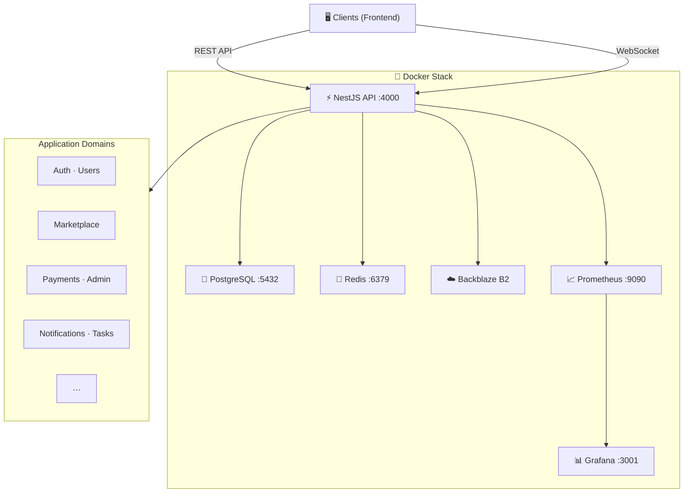

<div align="center">

# ⚒️ faber.md API

### Masters Marketplace

**NestJS 11** · **Prisma 7** · **PostgreSQL 18** · **Redis 7** · **Docker**

---

</div>

## 📖 About

faber.md is a backend service for a marketplace to search and manage masters (service professionals). Built on NestJS with a modular architecture: REST API, WebSocket, Bull queues, payments, notifications, and monitoring.

A separate **worker** is built (`nest build worker`, `worker.ts`) — background tasks without the full HTTP API stack.

---

## 🛠 Tech Stack

**Core:** Node.js ≥ 20 · TypeScript 5.9 · NestJS 11 (Express)

**Data:** PostgreSQL 18 · Prisma 7 · Redis 7 · Bull Queues

**Auth:** JWT (Access + Refresh) · Passport.js · OAuth2 (Google)

**Real-time:** Socket.IO (WebSocket Gateway)

**Storage:** Backblaze B2 (S3-compatible) · Multer

**Payments:** MIA / MAIB QR

**Notifications:** Twilio SMS · WhatsApp · Nodemailer · Telegram Bot

**Security:** Helmet · CORS · Rate Limiting · Sanitize-HTML

**Monitoring:** Prometheus · Grafana · Winston

**Tests:** Jest · Supertest

**CI/CD:** GitHub Actions (4 workflows) · Dependabot

---

## 🏗 Architecture


```mermaid
graph TB
    Client["🖥 Clients (Frontend)"]

    Client -->|REST API| API
    Client -->|WebSocket| API

    subgraph Docker["🐳 Docker Stack"]
        API["⚡ NestJS API :4000"]
        PG["🐘 PostgreSQL :5432"]
        RD["🔴 Redis :6379"]
        S3["☁️ Backblaze B2"]
        PROM["📈 Prometheus :9090"]
        GRAF["📊 Grafana :3001"]
    end

    API --> PG
    API --> RD
    API --> S3
    API --> PROM
    PROM --> GRAF

    subgraph Domains["Application Domains"]
        direction LR
        M1["Auth · Users"]
        M2["Marketplace"]
        M3["Payments · Admin"]
        M4["Notifications · Tasks"]
        M5["…"]
    end

    API --> Domains
```

---

## 🚀 Quick Start

### Requirements

- Node.js ≥ 20 and npm ≥ 10
- Docker + Docker Compose (recommended)
- PostgreSQL 18 and Redis 7 (if running without Docker)

### Step 1 — Clone

```bash
git clone <repository-url>
cd api-master
npm install
```

### Step 2 — Environment Setup

```bash
cp .env.docker.example .env.docker
node scripts/generate-secrets.js
```

Fill in the required variables in `.env.docker` (see [environment variables](#-environment-variables)).

### Step 3 — Run via Docker 🐳

```bash
# Start all services
docker-compose -f docker-compose.dev.yml up -d --build

# Apply migrations
npm run docker:migrate

# Seed test data
npm run docker:seed
```

### Step 4 — Verify

| Service | URL |
|---|---|
| API | `http://localhost:4000` |
| Swagger Docs | `http://localhost:4000/docs` |
| Health Check | `http://localhost:4000/health` |
| Prisma Studio | `http://localhost:5555` |
| Redis Commander | `http://localhost:8081` |
| Prometheus | `http://localhost:9090` |
| Grafana | `http://localhost:3001` |

> **Note:** Redis Commander and Grafana are available with login `admin` / `admin`.

---

## 🔐 Environment Variables

<details>
<summary>🔽 Click to expand full list</summary>

<br>

### Core

| Variable | Required | Description | Default |
|---|:---:|---|---|
| `NODE_ENV` | ✅ | `development` or `production` | `development` |
| `PORT` | — | API port | `4000` |
| `API_URL` | — | Public API URL | `http://localhost:4000` |
| `FRONTEND_URL` | ✅ prod | Frontend URL | `http://localhost:3000` |

### Database & Redis

| Variable | Required | Description | Default |
|---|:---:|---|---|
| `DATABASE_URL` | ✅ | PostgreSQL connection string | — |
| `REDIS_URL` | ✅ | Redis connection string | `redis://redis:6379` |
| `REDIS_HOST` | — | Redis host | `redis` |
| `REDIS_PORT` | — | Redis port | `6379` |

### JWT & Encryption

| Variable | Required | Description |
|---|:---:|---|
| `JWT_ACCESS_SECRET` | ✅ | Access token secret (min. 32 chars) |
| `JWT_OAUTH_PENDING_SECRET` | ✅ in prod | Separate secret for short-lived JWT "complete profile after OAuth"; must differ from `JWT_ACCESS_SECRET` in production. Optional in dev (falls back to access secret) |
| `JWT_REFRESH_SECRET` | ✅ | Refresh token secret (min. 32 chars) |
| `JWT_ACCESS_EXPIRY` | — | Access token lifetime (`3d`) |
| `ID_ENCRYPTION_SECRET` | ✅ | ID encryption secret (32 chars) |
| `ENCRYPTION_KEY` | ✅ | Encryption key (64 hex chars) |

### OAuth (optional)

| Variable | Description |
|---|---|
| `GOOGLE_CLIENT_ID` / `GOOGLE_CLIENT_SECRET` | Google OAuth |

### MIA Payments (optional)

| Variable | Description | Default |
|---|---|---|
| `MIA_CLIENT_ID` / `MIA_CLIENT_SECRET` | MAIB API keys | — |
| `MIA_BASE_URL` | MIA API URL | `https://api.maib.md` |
| `MIA_SANDBOX` | Sandbox mode | `true` |

### Files — Backblaze B2 (optional)

| Variable | Description | Default |
|---|---|---|
| `B2_APPLICATION_KEY_ID` / `B2_APPLICATION_KEY` | B2 keys | — |
| `B2_BUCKET` | Bucket name | `faber-md-uploads` |
| `B2_REGION` | Region | `eu-central-003` |

### Notifications (optional)

| Variable | Description |
|---|---|
| `TWILIO_ACCOUNT_SID` / `TWILIO_AUTH_TOKEN` | Twilio (SMS) |
| `TWILIO_PHONE_NUMBER` | SMS sender number |
| `TELEGRAM_BOT_TOKEN` / `TELEGRAM_CHAT_ID` | Telegram Bot |
| `EMAIL_ENABLED` | Enable email (`false`) |
| `SMS_ENABLED` | Enable SMS (`false`) |

### Rate Limiting

| Variable | Description | Default |
|---|---|---|
| `RATE_LIMIT_TTL` | Limit window (ms) | `60000` |
| `RATE_LIMIT_MAX` | Max requests | `100` |

</details>

---

## 🐳 Docker

### Dev Environment

```bash
npm run docker:up          # alias: docker:dev:up — start stack
npm run docker:dev:down    # stop
npm run docker:dev:build   # rebuild images
npm run docker:logs        # API container logs
```

| Container | Port | Purpose |
|---|---|---|
| `fabermd-api-dev` | 4000 | NestJS API |
| `fabermd-postgres` | 5432 | PostgreSQL |
| `fabermd-redis` | 6379 | Redis |
| `fabermd-redis-commander` | 8081 | Redis GUI |
| `fabermd-prisma-studio` | 5555 | Visual DB editor |
| `fabermd-prometheus-dev` | 9090 | Metrics |
| `fabermd-grafana-dev` | 3001 | Dashboards |

### Prod Environment

```bash
npm run docker:prod:up       # start
npm run docker:prod:down     # stop
npm run docker:prod:rebuild  # rebuild and recreate
npm run docker:prod:logs     # logs
```

> Prod ports: API `4001`, PostgreSQL `5433`, Redis `6380`, Prometheus `9091`, Grafana `3002`.

### Dockerfile

Multi-stage build:

- **builder** → TypeScript compilation + Prisma Generate
- **dependencies** → Production-only dependencies
- **production** → Alpine + non-root user + dumb-init + healthcheck
- **development** → Full environment with hot-reload

---

## 📜 NPM Scripts

### Development & Running

| Command | Description |
|---|---|
| `npm run start` | Start without watch |
| `npm run start:dev` | API with hot-reload (`nest start --watch`) |
| `npm run start:debug` | API with debugger and watch |
| `npm run start:prod` | Run built `dist/main.js` |
| `npm run build` | Build API (`nest build`) |
| `npm run build:worker` | Build worker (`nest build worker`) |
| `npm run start:worker` | Run `dist/worker.js` |
| `npm run start:worker:dev` | Worker via ts-node (development) |
| `npm run lint` | ESLint with auto-fix |
| `npm run format` | Prettier for `src/` and `test/` |
| `npm run prepare` | Husky (git hooks) |

### Prisma & Data

| Command | Description |
|---|---|
| `npm run prisma:generate` | Generate Prisma Client |
| `npm run prisma:migrate` | `prisma migrate dev` (migration name `init` — pass your own name via CLI if needed) |
| `npm run prisma:reset` | ⚠️ Full DB reset |
| `npm run seed` | Seed from `prisma/seed.ts` |
| `npm run seed:dev` | `prisma/seed-dev.ts` |
| `npm run seed:prod` | `prisma/seed-prod.ts` |
| `npm run local:recreate:db` | reset → migrate → generate → seed (locally) |

> Prisma Studio in Docker: `npm run docker:studio` (port 5555). Locally: `npx prisma studio`.

### Docker (general & dev)

| Command | Description |
|---|---|
| `npm run docker:up` / `docker:dev:up` | Start dev stack |
| `npm run docker:down` / `docker:dev:down` | Stop dev stack |
| `npm run docker:build` / `docker:dev:build` | Build dev images |
| `npm run docker:logs` | API logs in dev |
| `npm run docker:dev:create` | build → up → reset → migrate → generate → seed (full dev DB recreation in container) |
| `npm run docker:migrate` | `prisma migrate deploy` in dev container |
| `npm run docker:migrate:dev` | same as `docker:migrate` |
| `npm run docker:migrate:create` | interactive new migration in dev container |
| `npm run docker:migrate:reset` | reset in dev container |
| `npm run docker:migrate:prod` | migrations in prod container |
| `npm run docker:generate` | `prisma generate` in dev container |
| `npm run docker:seed` / `docker:seed:prod` | seed in dev / prod container |
| `npm run docker:studio` | start Prisma Studio service (compose) |
| `npm run docker:studio:logs` | Prisma Studio logs |
| `npm run docker:prune` | clean dev + prod volumes/images |
| `npm run docker:prune:dev` / `docker:prune:prod` | clean by environment |

### Docker (prod)

| Command | Description |
|---|---|
| `npm run docker:prod:up` | Start prod stack |
| `npm run docker:prod:down` | Stop |
| `npm run docker:prod:build` | Build |
| `npm run docker:prod:logs` | Logs |
| `npm run docker:prod:rebuild` | Rebuild and recreate containers |

### Redis

| Command | Description |
|---|---|
| `npm run redis:cli` | Redis CLI in container |
| `npm run redis:ping` | PING check |
| `npm run redis:keys` | `cache:*` keys |
| `npm run redis:flush` | ⚠️ Flush current Redis DB |
| `npm run redis:commander` | Start Redis Commander |

### Tests

| Command | Description |
|---|---|
| `npm test` | Unit tests (`test/jest-unit.json`) |
| `npm run test:watch` | Watch mode |
| `npm run test:cov` | With coverage |
| `npm run test:e2e` | E2E (`test/jest-e2e.json`) |
| `npm run test:e2e:debug` | E2E with `detectOpenHandles` |
| `npm run test:api` | E2E for `test/api` only |

### Utilities

| Command | Description |
|---|---|
| `npm run generate:secrets` | Generate secrets (`scripts/generate-secrets.js`) |
| `npm run backup` | DB backup (`scripts/backup.sh`, requires bash) |
| `npm run restore` | Restore (`scripts/restore.sh`) |
| `npm run update:deps` | Update dependencies (npm-check-updates `-u`) |
| `npm run update:deps:check` | Show available updates without changes |

---

## 📂 Project Structure

```
api-master/
│
├── .github/workflows/          CI/CD (backend-ci, docker-build, docker-health, pr-checks)
├── docker/                     Grafana, Prometheus, Redis configs
├── prisma/
│   ├── migrations/             SQL migrations
│   ├── seeds/                  Helper seeds (core, demo, connection)
│   ├── schema.prisma
│   ├── seed.ts                 Seed entry point
│   ├── seed-dev.ts
│   └── seed-prod.ts
├── scripts/                    backup, restore, generate-secrets, etc.
├── src/
│   ├── main.ts                 HTTP API entry point
│   ├── worker.ts               Background worker entry point
│   ├── app.module.ts           Root application module
│   ├── worker.module.ts        Worker module (Bull, cron, subset of domains)
│   ├── app/                    Base app routes (health, etc.)
│   ├── config/                 Configuration: CORS, Helmet, Bull, Winston, shutdown, validation
│   ├── common/                 Decorators, guards, interceptors, pipes, filters, constants
│   ├── middleware/
│   └── modules/                Domain and infrastructure modules (see below)
├── test/
│   ├── api/                    API / E2E
│   └── (jest-unit.json, jest-e2e.json)
├── nest-cli.json               `api` and `worker` projects (SWC)
├── Dockerfile
├── docker-compose.dev.yml
├── docker-compose.prod.yml
└── package.json
```

---

## 🧩 API Modules

Modules live in `src/modules/`. **Functional** modules are connected in `app.module.ts`; some are grouped by aggregators (`*GroupModule`).

### Application & Settings

| Path / Module | Purpose |
|---|---|
| `app/` | Root HTTP routes (incl. health), `AppService` |
| `app-settings/` | Application settings from DB (feature flags and params for other modules) |

### Auth & Users (`auth-group`, `users`)

| Module | Purpose |
|---|---|
| `auth/auth/` | JWT, registration/login, OAuth (Google), refresh |
| `auth/security/` | Security: rate limiting, brute-force protection |
| `auth/phone-verification/` | Phone verification |
| `users/` | User profiles, avatars |

### Marketplace (`marketplace-group`)

| Module | Purpose |
|---|---|
| `marketplace/masters/` | Master profiles, search, portfolio |
| `marketplace/categories/` | Service categories |
| `marketplace/cities/` | Cities |
| `marketplace/tariffs/` | Tariffs (Basic / Plus / Pro) |
| `marketplace/leads/` | Client requests |
| `marketplace/bookings/` | Bookings |
| `marketplace/reviews/` | Reviews and ratings |
| `marketplace/favorites/` | Favorites |
| `marketplace/chat/` | Chat (together with WebSocket) |
| `marketplace/promotions/` | Promotions |

### Payments & Admin

| Module | Purpose |
|---|---|
| `payments/` | MIA / MAIB QR payments |
| `admin/admin/` | Admin panel (ADMIN role) |

> `analytics`, `export`, `reports` are used beyond admin — connected separately in the root `app.module.ts`.

### Notifications (`notifications-group`)

| Module | Purpose |
|---|---|
| `notifications/notifications/` | In-app, SMS, Telegram, Bull queues, WebSocket integration |
| `notifications/web-push/` | Web Push |
| `notifications/digest/` | Digests / subscriptions |

### Engagement & Analytics

| Module | Purpose |
|---|---|
| `engagement/recommendations/` | Master recommendations |
| `engagement/referrals/` | Referral program |
| `analytics/` | Analytics and metrics |
| `export/` | Export (Excel, PDF), queues |
| `reports/` | Complaints and reports |

### Compliance & Audit

| Module | Purpose |
|---|---|
| `consent/` | User consents (GDPR-like scenarios) |
| `compliance/` | Compliance |
| `audit/` | Action audit log |
| `verification/` | Master verification (documents) |

### Infrastructure

| Module | Purpose |
|---|---|
| `infrastructure/files/` | File uploads, S3/B2, Multer |
| `infrastructure/tasks/` | Scheduler and background tasks (cron / Bull) |
| `infrastructure/websocket/` | Socket.IO gateway |
| `infrastructure/cache-warming/` | Cache warming |
| `infrastructure/web-vitals/` | Web Vitals collection from client |

### Shared Services (`shared/`)

| Module | Purpose |
|---|---|
| `shared/database/` | PrismaModule |
| `shared/redis/` | Redis client |
| `shared/cache/` | Caching |
| `shared/encryption/` | Encryption (connected in auth/verification) |
| `shared/utils/` | Utilities |

### Other

| Module | Purpose |
|---|---|
| `email/` | Email sending (Nodemailer) |

### Worker

`worker.module.ts` connects a subset of modules (Bull processors, cron, cache warming, export, and dependencies without the full HTTP API). Build: `npm run build:worker`, run: `npm run start:worker` / `start:worker:dev`.

---

## 📊 Monitoring

### Prometheus + Grafana

- **Prometheus** (`localhost:9090`) — metrics collection via `prom-client`
- **Grafana** (`localhost:3001`) — visualization dashboards
- Configs: `docker/prometheus.yml`, `docker/grafana/`

### Logging

- **Winston** with rotation (`winston-daily-rotate-file`)
- JSON format in production, colorized output in development
- Logs saved to `logs/`

### Health Check

```bash
curl http://localhost:4000/health
```

Checks PostgreSQL and Redis availability via `@nestjs/terminus`.

---

## ⚙️ CI/CD

| Workflow | Trigger | What it does |
|---|---|---|
| `backend-ci.yml` | push, PR | Lint → Unit tests → Type-check |
| `docker-build.yml` | push, PR | Docker image build |
| `docker-health.yml` | push, PR | Healthcheck in Docker |
| `pr-checks.yml` | PR | Full check (lint, tests, build) |

**Dependabot** automatically updates npm dependencies and GitHub Actions.

---

## 🚀 Production

### Checklist

- [ ] `NODE_ENV=production`
- [ ] Secure secrets (`npm run generate:secrets`)
- [ ] Replace default passwords (PostgreSQL, Grafana, Redis)
- [ ] Set `FRONTEND_URL`
- [ ] SSL/TLS via reverse proxy (Nginx / Traefik)
- [ ] Backblaze B2 for file storage
- [ ] Configure DB backups

### Deploy

```bash
# 1. Create prod config from template
cp .env.production.example .env
# Fill in .env (secrets, API_URL, FRONTEND_URL)

# 2. Start (compose picks up .env)
npm run docker:prod:up

# 3. Migrations
npm run docker:migrate:prod

# 4. Seed (on first run)
npm run docker:seed:prod
```

### Security

- ✅ Non-root user in Docker
- ✅ Helmet (HSTS, CSP, Referrer Policy)
- ✅ Rate Limiting (Throttler)
- ✅ CORS — allowed domains only
- ✅ Input Validation (class-validator)
- ✅ XSS protection (sanitize-html)
- ✅ Graceful Shutdown (SIGTERM / SIGINT)
- ✅ Secret validation on startup

---

<div align="center">

© 2026 faber.md Team · All rights reserved

</div>
